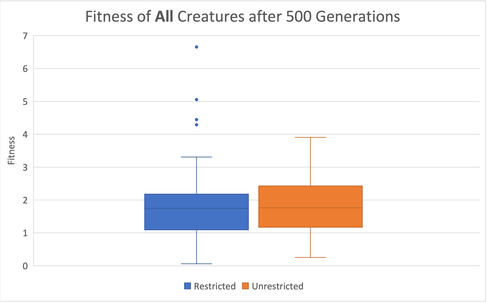
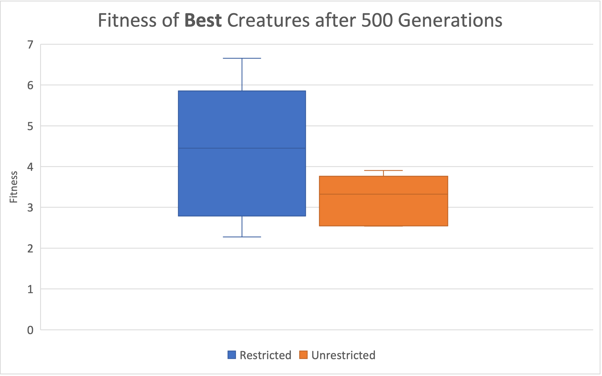

# Restricting number of body units for locomotion optimization

## Overview
After using PyroSim to build a simulator that can generate creatures with random bodies and brains, I felt that the morphospace was too large to evolve an optimal creature in an efficient time. So, I wanted to see if there were any limitations I could place on the morphospace that would have no effect on, or maybe even improve, the fitness of the evolved creatures. Finding such a limitation would decrease the number of possible creatures and so would allow more time for fine-tuning other traits of the creature. For my experiment, I decided to test whether or not restricting the number of body units of the creature would have an effect on its locomotive capabilities. I chose this as the limitation because I hypothesized that creatures with less body units would have better fitness because I thought that having more body parts would both overcomplicate the creature and make changes to the neural network less significant.

## Experimental Design
To test how limiting the number of body units affects fitness, I ran two groups of trials: one with "unrestricted creatures" and one with "restricted creatures". Unrestricted creatures could have bodies made of 3-10 units, while restricted creatures were limited to 3-6 units. Creatures were generated with a number of body units within its allowed range, and were not allowed to mutate in such a way to leave that range. Each group consisted of 5 trials, where each trial tracked a random population of 10 creatures that evolved in parallel for 500 generations. The highest fitness at each timestep was recorded, as well as the final fitness of all the creatures.

### Morphospace
The simulator creates creatures with the following morphologies:
* Each creature contains a number of links specified by its trial group
* Each link is a rectangular prism with each dimension between 0-1 units
* Each link can have at most one joint on each of its faces
* Two links that connect at a joint do so at the center of two of their faces

The simulator creates creatures with the following neural networks:
* Links are randomly assigned as sensor neurons or non-sensor neurons
* Every joint has a motor neuron
* There is a synapse with a randomly generated weight connecting each sensor neuron to each motor neuron

### Random Creature Generation
In order to randomly design a creature without any overlapping links, I created a Tree class and a Node class to first represent the creature's morphology with a tree, where each node represents one of the creature's links. This allowed me to develop a random hierarchy of parent-child relationships, which worked nicely with the parent-child relationships of pyrosim's joints. Once complete, I iterated over the tree to add in each link, joint and neuron. This is represented in the following diagram:

#### Creating the tree representation
Upon initialization, the Tree class randomly generates a tree for representing the creature's morphology using the following algorithm:
1. The Tree creates a root node, which is initalized with a random position and size, and creates a list called self.nodes with it as the sole item.
2. A random number between 5 and 10 is chosen for the number of additional nodes to add.
3. To add a new node, a random node is first chosen from self.nodes. This will be the parent of the new node.
4. If the parent node is already connected to 6 other nodes (one on each face), return to step 3 to pick a new parent.
5. Generate a new node with a random size and a random position such that it is connected to the parent node on a randomly chosen face
6. If this new node is underground or overlaps with any other node, return to step 5 to redesign the node.
7. Add the new node to self.nodes.
8. Repeat steps 3-7 based on the number selected in step 2.

#### Creating the body and brain from the tree representation
Once the tree is complete, the body and brain can be created with pyrosim using the following algorithm:
1. To add each link and join, call the Send_Cube function for the root node. For each child of the root node, use Send_Link to add the appropriate joint and repeat for that child.
2. To add the sensor neurons, iterate over self.nodes. If the node is assigned to be a sensor neuron, call Send_Sensor_Neuron for the link reprsented by that node.
3. To add the motor neurons, iterate over self.nodes. For all nodes, call Send_Motor_Neuron for the joint comprised of that node and its parent.
4. To add the synapses, call Send_Synapse for each pair of sensor and motor neurons

### Random Evolution of Creatures
#### Method
Each creature could be mutated in one of three ways:
1. Updating the weight of a single synapse between a motor neuron and a sensor neuron
2. Adding a random link
3. Removing a random link

In order to select which of these mutation would occur, a random integer was chosen between 0 and 5. If 0 was selected, a random link was deleted. If 1 was selected, a random link was added. For any other numbers, a random synapse weight was updated. This produced a 16.7% chance of a node being added, a 16.7% chance of a node being deleted, and a 66.7% chance of a random weight being updated. This process is outlined in the following diagram:

#### Fitness
Fitness was measured by calculating the distance that the creature travelled in the +x direction at the end of the simulation. Creatures who travelled further in the +x direction were favored.

## Results

<table>
<tr>
<td>

</td>
<td>

</td>
</tr>
<tr>
<td>
<b>Figure 1</b>

Highest fitness value among all 10 creatures at each generation for each "restricted creature" trial
</td>
<td>
<b>Figure 2</b>

Highest fitness value among all 10 creatures at each generation for each "unrestricted creature" trial
</td>
</tr>
</table>

<table>
<tr>
<td>

</td>
<td>

</td>
</tr>
<tr>
<td>
<b>Figure 3</b>

Final fitness for every creature

T-test value: 0.9924988039
</td>
<td>
<b>Figure 4</b>

Final fitness for the best creature in each trial

T-test value: 0.1842313902
</td>
</tr>
</table>

## Conclusion
Figure 3 and its corresponding t-test show that there is no significant difference between the fitness of the restricted and unrestricted creatures. However, Figures 1, 2, and 4 show that there is a more significant difference between the fitness of the best restricted and unrestricted creatures. However, because the best creatures only make up 5 data points in each group, this result is not conclusive and requires further testing.

This experiment provides evidence to support that restricting the number of body units successfuly limits the morphospace without impacting the fitness of the produced creatures. It also provides support that restricting the number of body units leads to the most fit creatures being more fit, but more testing is required.

## How to Run the Simulator

To generate and evolve a population of creatures, first edit any parameters in **constants.py**. For more details about each parameter view the section below. Then, run `python search.py` to start the simulation.

Once evolution is finished, you can watch any pickled simulation. Run `python review.py seed_num_gen`, where seed is the seed of the creature, num is the creature's number in the population, and gen is the generation. The generation must be one that was pickled. The creatures' files are stored in the **creatures** folder, so you can check for file names there.

### Parameters
* steps - number of steps
* pickle - how often the simulations is pickled
* numberOfGenerations - number of generations
* populationSize - population size
* seed - seed
* minLinks - minimum number of links
* maxLinks - maximum number of links
* motorJointRange - motor-joint range
* maxForce - max motor force.

## Sources
This project was developed with the help of the Ludobots course on reddit: https://www.reddit.com/r/ludobots/
